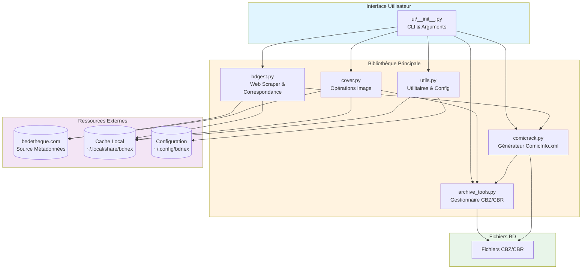
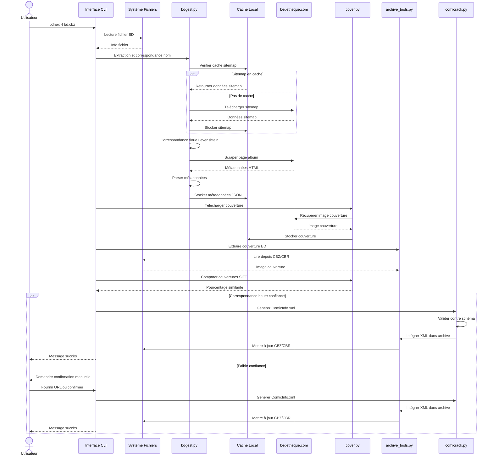

# BDneX


[](https://codecov.io/gh/lbesnard/bdnex)
[](https://www.python.org/downloads/)
[](https://opensource.org/licenses/MIT)

**BDneX** est un outil de gestion et de balisage des métadonnées pour les bandes dessinées françaises. Il récupère automatiquement les métadonnées depuis [bedetheque.com](https://bedetheque.com) et les intègre dans vos fichiers de BD en utilisant le format standard ComicRack.

📖 [English version](README.md)

## Table des matières
- [Motivation](#motivation)
- [Fonctionnalités](#fonctionnalités)
- [Installation](#installation)
- [Démarrage rapide](#démarrage-rapide)
- [Utilisation](#utilisation)
- [Configuration](#configuration)
- [Tests](#tests)
- [Architecture](#architecture)
- [Contribuer](#contribuer)
- [Feuille de route](#feuille-de-route)
- [Dépannage](#dépannage)
- [Licence](#licence)

## Motivation

Contrairement au balisage musical, il n'existe pas de vocabulaire standard convenu pour le balisage des bandes dessinées en général. Cependant, le standard ComicRack est utilisé par la plupart des gestionnaires de bibliothèques tels que [Komga](https://komga.org/).

Bien que des outils comme [ComicTagger](https://github.com/comictagger/comictagger) existent pour les comics américains (utilisant l'API [Comic Vine](https://comicvine.gamespot.com)), les bandes dessinées françaises sont largement sous-représentées dans ces bases de données.

**BDneX comble cette lacune** en :
- Fournissant des métadonnées complètes pour les BD françaises depuis bedetheque.com
- Utilisant un algorithme de correspondance floue intelligent pour identifier vos BD
- Intégrant automatiquement les métadonnées dans les fichiers **CBZ** et **CBR**
- Facilitant l'organisation de grandes bibliothèques de BD par genre, auteur, note, etc.
- Permettant le partage de listes de lecture basées sur des métadonnées plutôt que sur des noms de fichiers obscurs

Inspiré par l'excellent gestionnaire musical [beets](https://github.com/beetbox/beets).

## Fonctionnalités

### Fonctionnalités actuelles
- 🔍 **Recherche intelligente** : Récupère les sitemaps de bedetheque.com pour une correspondance complète des albums
- 🎯 **Correspondance floue** : Algorithme de distance de Levenshtein pour trouver les noms d'albums même avec des fautes de frappe
- 🌐 **Web Scraping** : Analyse le contenu des pages web avec BeautifulSoup
- 📋 **Format ComicRack** : Convertit les métadonnées analysées en ComicInfo.xml (standard ComicRack)
- 🖼️ **Vérification de couverture** : Comparaison d'images entre la couverture en ligne et celle de l'archive pour un score de confiance
- 💾 **Formats multiples** : Supporte les formats d'archives CBZ et CBR
- 🔄 **Traitement par lots** : Traite des répertoires entiers de BD en une seule fois
- ⚙️ **Configurable** : Paramètres personnalisables via un fichier de configuration YAML

### Métadonnées supportées
- Titre, Série, Numéro de volume
- Scénaristes, Dessinateurs, Coloristes, Encreurs
- Éditeur, Année de publication
- Synopsis/Résumé
- Genre et Tags
- Note de la communauté
- Nombre de pages
- Langue
- ISBN

## Installation

### Prérequis
- Python 3.8 ou supérieur
- pip (gestionnaire de paquets Python)
- (Optionnel) Conda pour la gestion d'environnement

### Option 1 : Utiliser Conda (Recommandé)

Créer et activer un environnement virtuel :

```bash
# Créer l'environnement depuis le fichier fourni
conda env create --file=environment.yml

# Activer l'environnement
conda activate bdnex
```

### Option 2 : Utiliser venv

```bash
# Créer un environnement virtuel
python3 -m venv bdnex-env

# L'activer (Linux/Mac)
source bdnex-env/bin/activate

# L'activer (Windows)
bdnex-env\Scripts\activate
```

### Modes d'installation

**Installation utilisateur** (pour usage général) :
```bash
pip install .
```

**Installation développeur** (pour contribuer) :
```bash
pip install -e .[dev]
```

Cela installe des outils de développement supplémentaires comme `pytest` et `ipdb`.

### Configuration initiale

Après l'installation, initialisez BDneX pour télécharger les sitemaps de bedetheque.com :

```bash
bdnex --init
```

Cela télécharge et met en cache les données de sitemap pour une correspondance plus rapide des BD (peut prendre quelques minutes au premier lancement).

## Démarrage rapide

Traiter un seul fichier de BD :
```bash
bdnex -f /chemin/vers/bd.cbz
```

Traiter un répertoire entier :
```bash
bdnex -d /chemin/vers/dossier/bds
```

L'outil va :
1. Extraire le nom du fichier BD et tenter de le faire correspondre avec les entrées de bedetheque.com
2. Télécharger les métadonnées et l'image de couverture
3. Comparer les couvertures pour vérifier la correspondance
4. Intégrer les métadonnées en tant que ComicInfo.xml dans l'archive
5. Sauvegarder le fichier BD mis à jour

## Utilisation

### Options de ligne de commande

```bash
bdnex [OPTIONS]
```

**Options :**
- `-f, --input-file <chemin>` : Traiter un seul fichier de BD
- `-d, --input-dir <chemin>` : Traiter toutes les BD dans un répertoire (recherche récursive des fichiers .cbz et .cbr)
- `-i, --init` : Initialiser ou forcer le re-téléchargement des sitemaps de bedetheque.com
- `-v, --verbose <niveau>` : Définir le niveau de verbosité des logs (par défaut : info)

### Exemples

**Traiter un seul fichier :**
```bash
bdnex -f "/bds/Asterix Tome 1 - Asterix le Gaulois.cbz"
```

**Traiter un répertoire entier :**
```bash
bdnex -d /bds/collection
```

**Forcer la mise à jour du sitemap :**
```bash
bdnex --init
```

**Combiner les options :**
```bash
bdnex -d /bds/nouvelles-acquisitions -v debug
```

### Exemple de sortie

Lors du traitement d'une BD, vous verrez une sortie comme :

```
2024-12-29 15:30:00,123 - INFO     - bdnex.ui - Traitement de /bds/Nains Tome 1.cbz
2024-12-29 15:30:00,234 - INFO     - bdnex.lib.bdgest - Recherche de "Nains Tome 1" dans les fichiers sitemap de bedetheque.com
2024-12-29 15:30:00,345 - DEBUG    - bdnex.lib.bdgest - Correspondance du nom d'album réussie
2024-12-29 15:30:00,456 - DEBUG    - bdnex.lib.bdgest - Score de Levenshtein : 87.5
2024-12-29 15:30:00,567 - DEBUG    - bdnex.lib.bdgest - URL correspondante : https://m.bedetheque.com/BD-Nains-Tome-1-Redwin-de-la-Forge-245127.html
2024-12-29 15:30:01,678 - INFO     - bdnex.lib.bdgest - Conversion des métadonnées analysées vers le modèle ComicRack
2024-12-29 15:30:01,789 - INFO     - bdnex.lib.cover - Vérification de la couverture du fichier d'entrée avec la couverture en ligne
2024-12-29 15:30:02,890 - INFO     - bdnex.lib.cover - Pourcentage de correspondance de la couverture : 92.5
2024-12-29 15:30:02,901 - INFO     - bdnex.lib.comicrack - Ajout de ComicInfo.xml à /bds/Nains Tome 1.cbz
2024-12-29 15:30:03,012 - INFO     - bdnex.ui - Traitement de l'album terminé
```

### Mode interactif

Si la correspondance automatique échoue ou si la confiance est faible, BDneX vous demandera :
- De saisir manuellement une URL bedetheque.com
- De rechercher interactivement l'album correct
- De confirmer si vous souhaitez procéder à l'intégration des métadonnées

## Configuration

BDneX utilise un fichier de configuration YAML situé à :
- **Linux/Mac** : `~/.config/bdnex/bdnex.yaml`
- **Windows** : `%USERPROFILE%\.config\bdnex\bdnex.yaml`

Le fichier de configuration est créé automatiquement au premier lancement à partir du modèle par défaut.

### Options de configuration

```yaml
bdnex:
  config_path: ~/.config/bdnex       # Répertoire de configuration
  share_path: ~/.local/share/bdnex   # Répertoire de données/cache

directory: /chemin/vers/bibliothèque/bds    # Répertoire de bibliothèque par défaut

import:
  copy: no          # Copier les fichiers lors de l'import
  move: yes         # Déplacer les fichiers lors de l'import
  replace: yes      # Remplacer les fichiers existants
  autotag: no       # Baliser automatiquement sans confirmation
  rename: yes       # Renommer les fichiers basés sur les métadonnées

library: ~/.local/share/bdnex/bdnex.sqlite  # Fonctionnalité future : base de données

paths:
  # Conventions de nommage pour les bibliothèques organisées
  default: '%language/%type/%title (%author) [%year]/%title - %volume (%author) [%year]'
  oneshot: '%language/oneShots/%title (%author) [%year]/%title (%author) [%year]'
  series: '%language/series/%title (%author)/%title - %volume'

cover:
  match_percentage: 40  # Pourcentage minimum de similarité de couverture pour auto-confirmation
```

### Stockage des données

BDneX stocke les données en cache dans `~/.local/share/bdnex/` :
- `bedetheque/sitemaps/` : Fichiers sitemap en cache
- `bedetheque/albums_html/` : Pages d'albums téléchargées
- `bedetheque/albums_json/` : Métadonnées analysées au format JSON
- `bedetheque/covers/` : Images de couverture téléchargées

## Tests

### Exécuter les tests

BDneX utilise pytest pour les tests. Pour exécuter la suite de tests :

```bash
# Exécuter tous les tests
pytest

# Exécuter avec sortie détaillée
pytest -v

# Exécuter un fichier de test spécifique
pytest test/test_utils.py

# Exécuter un test spécifique
pytest test/test_cover.py::TestCover::test_front_cover_similarity_good_match
```

### Couverture des tests

Vérifier la couverture du code :

```bash
# Installer l'outil de couverture (s'il n'est pas installé avec les dépendances dev)
pip install coverage

# Exécuter les tests avec couverture
coverage run -m pytest

# Voir le rapport de couverture
coverage report

# Générer un rapport HTML de couverture
coverage html
# Ouvrir htmlcov/index.html dans votre navigateur
```

Couverture de test actuelle :
- **Global** : ~86%
- `archive_tools.py` : 100%
- `ui/__init__.py` : 100%
- `cover.py` : 98%
- `utils.py` : 91%
- `bdgest.py` : 87%
- `comicrack.py` : 58%

### Structure des tests

Les tests sont organisés dans le répertoire `test/` :
- `test_archive_tools.py` : Extraction et manipulation d'archives
- `test_bdgest.py` : Scraping BedeTheque et analyse des métadonnées
- `test_cover.py` : Comparaison et téléchargement d'images de couverture
- `test_utils.py` : Fonctions utilitaires (config, JSON, opérations sur fichiers)
- `test_comicrack.py` : Génération et intégration de ComicInfo.xml
- `test_ui.py` : Tests du module interface utilisateur
- `test_integration.py` : Tests end-to-end

## Architecture

### Structure du projet

```
bdnex/
├── bdnex/                  # Package principal
│   ├── conf/              # Fichiers de configuration et schémas
│   │   ├── ComicInfo.xsd  # Schéma XML ComicRack
│   │   ├── bdnex.yaml     # Configuration par défaut
│   │   └── logging.conf   # Configuration des logs
│   ├── lib/               # Modules bibliothèque principaux
│   │   ├── archive_tools.py   # Gestion des fichiers CBZ/CBR
│   │   ├── bdgest.py          # Scraper BedeTheque
│   │   ├── comicrack.py       # Génération de ComicInfo.xml
│   │   ├── cover.py           # Opérations sur images de couverture
│   │   └── utils.py           # Fonctions utilitaires
│   └── ui/                # Interface utilisateur
│       └── __init__.py    # Implémentation CLI
├── test/                  # Suite de tests
├── README.md              # Documentation (anglais)
├── README_FR.md           # Documentation (français)
├── setup.py
└── environment.yml
```

#### Diagramme d'architecture



### Composants clés

1. **bdgest.py** : 
   - Télécharge et traite les sitemaps de bedetheque.com
   - Effectue une correspondance de chaîne floue utilisant la distance de Levenshtein
   - Scrape et analyse les métadonnées d'albums
   - Convertit au format ComicRack

2. **cover.py** :
   - Télécharge les images de couverture depuis bedetheque.com
   - Utilise la détection de caractéristiques SIFT pour la comparaison d'images
   - Calcule le pourcentage de similarité

3. **comicrack.py** :
   - Génère ComicInfo.xml à partir des métadonnées
   - Valide par rapport au schéma ComicInfo.xsd
   - Intègre le XML dans les archives de BD
   - Gère ComicInfo.xml existant (avec affichage des différences)

4. **archive_tools.py** :
   - Extrait les couvertures des archives
   - Supporte les formats ZIP (CBZ) et RAR (CBR)

5. **ui/__init__.py** :
   - Interface en ligne de commande
   - Gestion des arguments et options
   - Traitement par lots

### Flux de travail

```
Fichier BD → Extraction du nom → Correspondance floue → Scrape des métadonnées
                                     ↓
                            Téléchargement image couverture
                                     ↓
                            Comparaison couvertures (SIFT)
                                     ↓
                            Génération ComicInfo.xml
                                     ↓
                            Intégration dans archive → Fichier BD mis à jour
```

#### Diagramme du flux de travail



## Contribuer

Les contributions sont les bienvenues ! Voici comment commencer :

### Configuration de développement

1. Fork et cloner le dépôt :
```bash
git clone https://github.com/votreutilisateur/bdnex.git
cd bdnex
```

2. Installer en mode développement :
```bash
pip install -e .[dev]
```

3. Faire vos modifications et ajouter des tests

4. Exécuter la suite de tests :
```bash
pytest
```

5. Vérifier la couverture du code :
```bash
coverage run -m pytest
coverage report
```

### Style de code

- Suivre les directives de style PEP 8
- Utiliser des noms de variables et de fonctions descriptifs
- Ajouter des docstrings aux fonctions et classes
- Garder les fonctions ciblées et à usage unique
- Ajouter des annotations de type lorsque c'est approprié

### Ajouter des tests

Lors de l'ajout de nouvelles fonctionnalités :
1. Créer des tests dans le fichier `test/test_*.py` approprié
2. Utiliser `unittest.mock` pour les dépendances externes
3. Viser une couverture de code élevée (>80%)
4. Tester les cas limites et les conditions d'erreur

### Processus de Pull Request

1. Créer une branche de fonctionnalité : `git checkout -b feature/ma-fonctionnalite`
2. Faire vos modifications avec des messages de commit clairs
3. S'assurer que tous les tests passent
4. Mettre à jour la documentation si nécessaire
5. Soumettre une pull request avec une description claire

## Feuille de route

Fonctionnalités prévues pour les prochaines versions :

- [ ] **Base de données SQLite** : Garder des enregistrements des BD déjà traitées
- [ ] **Mode interactif** : CLI améliorée avec menus de sélection
- [ ] **Gestionnaire de catalogue** : Parcourir et gérer votre collection balisée
- [ ] **Convention de renommage** : Renommage automatique des fichiers basé sur les métadonnées et la configuration utilisateur
- [ ] **Sources supplémentaires** : Support de bdfugue.com et autres bases de données de BD françaises
- [ ] **Support de reprise** : Reprendre là où vous vous êtes arrêté dans le traitement par lots
- [ ] **Application GUI** : Application de bureau avec interface visuelle
- [ ] **Système de plugins** : Architecture extensible pour des sources de métadonnées personnalisées
- [ ] **Détection de doublons** : Trouver et gérer les BD en double
- [ ] **Listes de lecture** : Créer et gérer des listes de lecture
- [ ] **Interface web** : Interface de gestion basée sur navigateur
- [ ] **Support multilingue** : Support complet pour français et anglais dans l'interface

## Dépannage

### Problèmes courants

**Problème : "Cover matching percentage is low"**
- La correspondance automatique peut être incorrecte
- Vous serez invité à saisir manuellement l'URL bedetheque.com
- Vous pouvez ajuster `cover.match_percentage` dans la config pour être plus/moins strict

**Problème : "Album not found in sitemap"**
- Exécuter `bdnex --init` pour mettre à jour les sitemaps
- Essayer de simplifier le nom de fichier (supprimer les caractères spéciaux, infos d'édition)
- Utiliser le mode interactif pour rechercher manuellement

**Problème : "Import Error: No module named 'cv2'"**
- OpenCV n'est pas installé correctement
- Exécuter : `pip install opencv-contrib-python-headless`

**Problème : "Les fichiers RAR ne s'extraient pas"**
- Installer unrar : `sudo apt-get install unrar` (Linux) ou télécharger depuis [rarlab.com](https://www.rarlab.com/)

**Problème : Tests échouant avec "No source for code: config-3.py"**
- C'est un artefact de l'outil de couverture et peut être ignoré
- Les tests devraient quand même passer avec succès

### Mode Debug

Exécuter avec sortie de débogage détaillée :
```bash
bdnex -d /bds -v debug
```

### Obtenir de l'aide

- Vérifier les [Issues GitHub existantes](https://github.com/lbesnard/bdnex/issues)
- Ouvrir une nouvelle issue avec :
  - Votre OS et version Python
  - Commande exécutée
  - Message d'erreur complet
  - Exemple de nom de fichier causant des problèmes

## Licence

Ce projet est sous licence MIT - voir le fichier [LICENSE](LICENSE) pour plus de détails.

## Remerciements

- [bedetheque.com](https://bedetheque.com) pour la base de données complète de BD françaises
- [beets](https://github.com/beetbox/beets) pour l'inspiration sur la gestion de bibliothèque musicale
- [ComicRack](http://comicrack.cyolito.com/) pour le standard de métadonnées
- Tous les contributeurs qui aident à améliorer BDneX

---

**Note** : BDneX est actuellement en développement actif. Certaines fonctionnalités mentionnées dans la feuille de route sont planifiées mais pas encore implémentées. L'outil est fonctionnel pour son objectif principal de balisage des bandes dessinées françaises.
